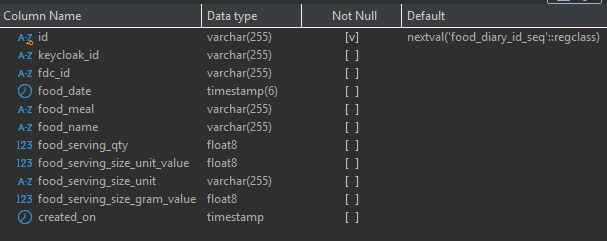
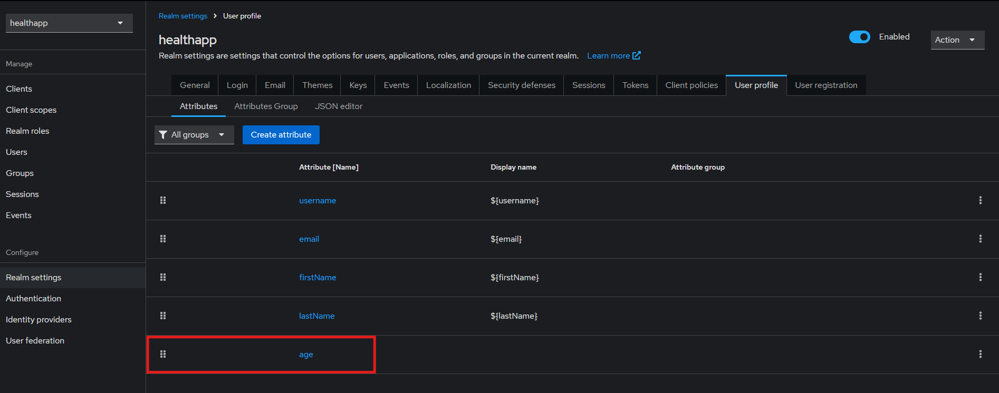

## Introduction
This work is done by both [Adrian Lee Jun Wei (git2467)](https://github.com/git2467) and [Ang Guang En (guangen96)](https://github.com/guangen96).

This is a Spring Boot backend project for our Health App that: 
- stores users' food entries in PostgreSQL database, using Spring Data JPA, RESTful APIs
- manages users' authentication and authorisation, using Spring Security, Keycloak (an open-source identity and access management solution)

The frontend project can be found [here](https://github.com/git2467/HealthApp-UI).

## RESTful APIs
`@RestController` - handles HTTP requests, responses

`@GetMapping`("/entry/id") - get existing food entry by id

`@GetMapping`("/entry/date") - get existing food entries by date

`@PostMapping`("/entry/create") - create new food entry

`@DeleteMapping`("/entry/delete") - delete existing food entry


## Spring Data JPA
`@Service` - contain business logic for data access

`@Entity`, `@Table`, `@Column` - map Java classes to database tables

`@Query`, `@Param` - write native SQL queries
```java
@Query("SELECT fe FROM FoodEntry fe WHERE fe.keycloakId = :keycloakId " +
        "AND fe.foodDate BETWEEN :startDate AND :endDate")
public List<FoodEntry> findFoodEntryByDate(
        @Param("keycloakId") String keycloakId,
        @Param("startDate") LocalDateTime startDateTime,
        @Param("endDate") LocalDateTime endDateTime
);
```
`@Getter`, `@Setter` - Lombok annotations that auto generates common methods


## PostgreSQL database


## Spring Security and Keycloak
`@Configuration`, `@EnableWebSecurity` - source of Spring Bean definitions on HTTP authentication, authorisation rules

`@Bean` - define a Spring Bean (an object managed by Spring Inversion of Control container)

`JSON Web Tokens (JWT)` - efficient & secure user authentication
```java
@Bean
//Decodes and validates JWT tokens
public JwtDecoder jwtDecoder() {...}

@Bean
//Converts the decoded JWT into a Spring Security Authentication object
public JwtAuthenticationConverter jwtAuthenticationConverter() {...}

@Bean
public SecurityFilterChain securityFilterChain(HttpSecurity http) throws Exception { 
    http
            //Requires authentication for all endpoints.
            .authorizeHttpRequests(authorize -> authorize.anyRequest().authenticated())
            .oauth2ResourceServer(oauth2 -> oauth2
                    //Use JWT tokens for authentication
                    .jwt(jwt -> jwt.jwtAuthenticationConverter(jwtAuthenticationConverter()))
            );
}
```

`User Account Management` - allow admins to create & manage user profiles, including storing of additional custom attributes ie. age



`User Session Management` - allow admins to view and manage a list of active user sessions\
`Session cookies` - maintain user's state between the client browser and server during a user session

